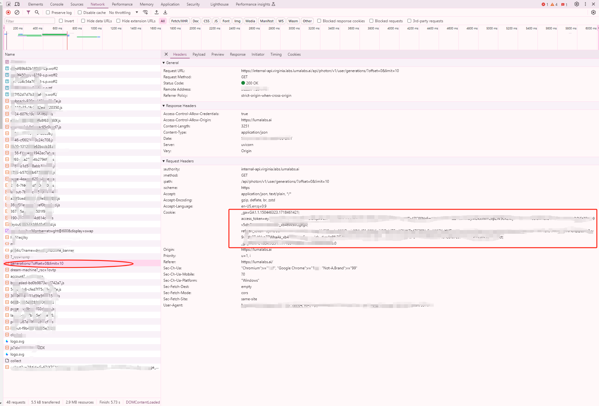

## Unofficial Luma API-ComfyUI version

**WARNING:** This project is for learning purpose only!

### Installation

- cd custom_nodes
- git clone https://github.com/superyoman/comfyui_lumaAPI.git
- If necessary: pip install -r requirements.txt
- Restart ComfyUI

### Info

- Login https://lumalabs.ai/.
- Use Chrome or other browsers to inspect the network requests (F12 -> XHR).
- Copy the cookie to key.json

- Use image_generation.json (in workflow) for Luma image2video generation
- Get the result id, record saved in output/luma video/record_id.txt
- Use check_result.json to get the video link if Luma generation finished,video will be downloaded automatically if *download* is true.
- Video will be saved in *output/luma video* folder
